# Face Frontalization

---

## Introduction

---

**측면 얼굴 이미지를 이용하여 정면 얼굴 이미지를 예측하는 딥러닝 모델입니다.**

 사람의 측면 사진만 보유하고 있을시 이 사람의 정면이 어떻게 생겼는지 궁금할 때가 있었을 것입니다. 예를 들어 소개팅을 받게 되었을 경우 소개팅 대상의 측면 사진만 있을 상황 처럼 일상 생활에서 재미삼아 사용이 가능하고, 더 나아가서 범행현장 CCTV에서 범인의 측면 얼굴만 찍혔을 경우 정면얼굴을 예측하여 몽타주로 활용이 가능하고, 백화점이나 마트에서 아이를 잃어버렸을 경우 등에서도 활용이 가능합니다.   

## Requirements

---

 keras와 tensorflow-gpu 를 이용하여 모델링을 하였습니다.

또한 얼굴 특징을 잘 찾기위하여 VGG16에 얼굴데이터를 가지고 학습시킨 VGGFace의 레이어와 weights를 이용하였습니다. keras버전 VGGFace는 아래 링크에서 확인 가능합니다.

[rcmalli/keras-vggface](https://github.com/rcmalli/keras-vggface)

자세한 사항은 [requirements.txt](https://github.com/sonwonho/Face-Frontalization/blob/master/requirements.txt) 에 있습니다.

## Data Set

---

[AI 오픈 이노베이션 허브](http://aihub.or.kr/)

**얼굴 이미지 데이터는 AIHub에서 제공하는 한국인 안면 이미지를 이용하였습니다.**

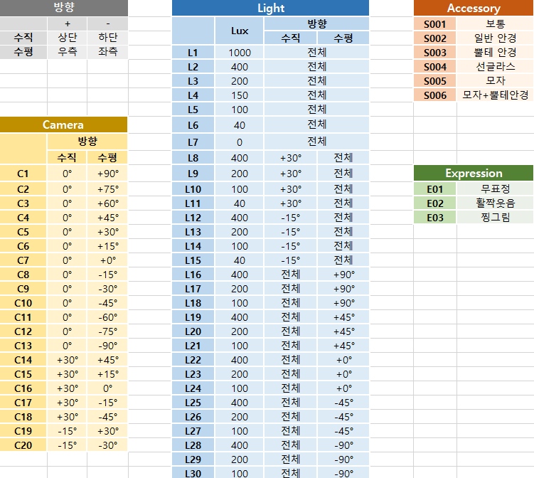

 300 명의 사람의 20개 각도 30개 조도 3개의 악세사리 3가지 표정을 다양한 입력에 대한 민감도를 줄이기 위하여 사용하였습니다.   (300 * 20 * 30 * 3 * 3 = 1,620,000장)

## Data preprocessing

---

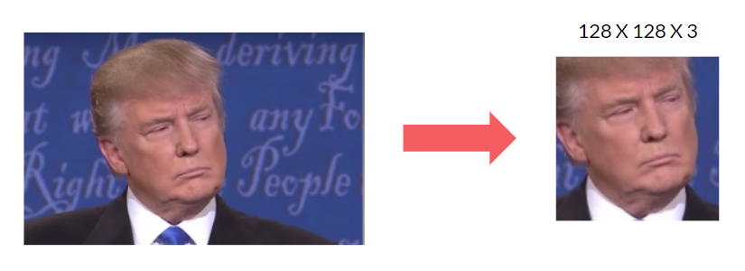

- Data set의 이미지가 배경 부분이 많아 모델이 학습하는데 얼굴의 특징에 집중하지 못하고 배경 특성 추출에도 노력을 하며, 이미지 사이즈가 크기에 GPU 메모리 사용량이 많아집니다.
- 사용자가 예측하고 싶은 이미지는 다양한 크기와 얼굴이 사진에 차지하는 비율이 다르기에 일정한 기준으로 얼굴 부분만 잘라서 모델의 Input에 넣어주어야 합니다.

 위 두가지 원인으로 Face Detecting 오픈 소스 중 다양한 각도를 찾을 수 있는 3DDFA를 참고하여 필요한 부분만 사용하였습니다.

[cleardusk/3DDFA](https://github.com/cleardusk/3DDFA)

Dlib 라이브러리에서 지원하는 get_frontal_face_detector() 함수와 미리 학습된  얼굴의 68개 랜드마크를 찾는 모델을 이용하여  shape_predictor(dlib_landmark_model) 함수를 이용하여 Face Detection 후 Crop을 하였습니다.

 모든 각도의 얼굴을 Detection 하지 못하고, 목, 귀등 얼굴이 아닌 다른 부분을 찾는 오류가 있습니다. 해당 오류들을 제외하고 데이터의 분포는 아래와 같습니다.

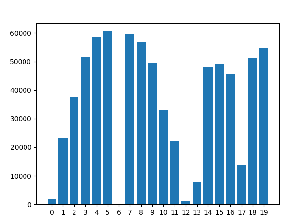

가로 축의 숫자는 얼굴의 각도들을 의미합니다.(6번은 정면얼굴) / 세로 축은 각 각도의 이미지들의 갯수입니다. ( 총 이미지는 726,562개 입니다.)

### X

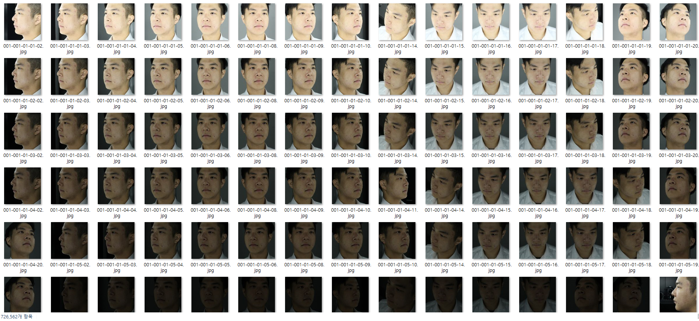

정면을 제외한 다양한 각도를 X

### Y

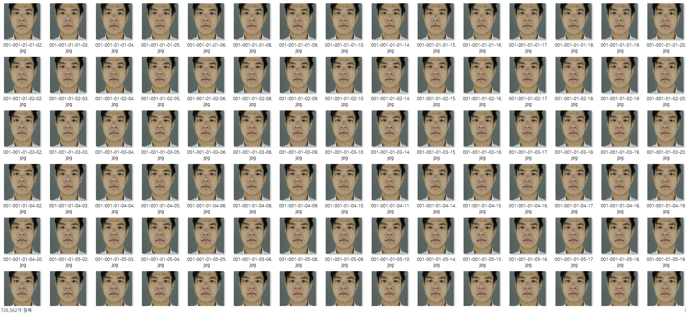

각 각도들에 1 대 1 매칭한 정면을 Y

## Data Generator

---

**datagenerator.py**

- 이미지 전체를 저장하고 있는 Numpy 데이터를 Load 후 학습을 시킬때에는 메모리가 부족한 현상을 해결 하기 위해 사용하였습니다.
- 이미지가 저장된 Numpy 벡터가 아닌 폴더에 있는 이미지의 파일경로명을 가지고 있는 리스트를 입력으로 주어 Batch_size 만큼 Numpy 벡터로 불러와 학습한 뒤 메모리 상에서 제거를 하여 메모리 관리를 하였습니다.

## Models

---

**pix2pix_vggface.py**

 Generator에는 autoencoder_unet_vggface.py의 모델과 구성을 같게 하였으며, Discriminator에는 선명한 결과를 위해 PacthGan 기법을 사용하여 pix2pix모델과 유사한 구조를 가진 모델을 만들었습니다.

- Data

    X = 정면을 제외한 다양한 각도의 이미지

    Y = 각 각도에 1대1 매칭한 정면 이미지

- Structure

    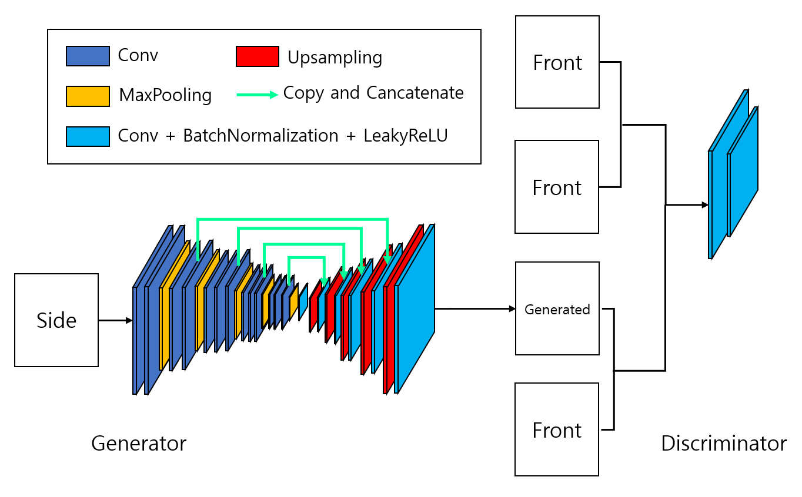

- Predictions

    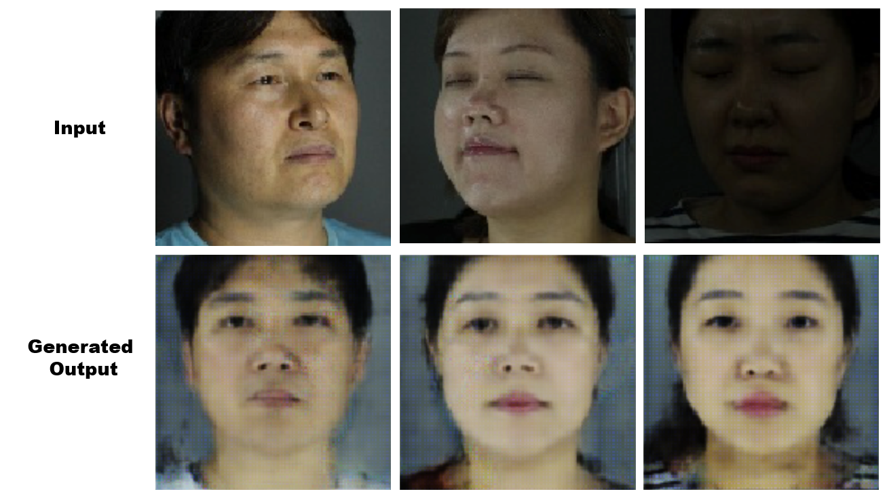

**autoencoder_unet_vggface.py**

 Encoder 부분은 VGGFace레이어와 weights를 이용하였으며 특성을 더욱 잘 보존하기 위하여 U-net 구조를 이용하여 만들었습니다.

- Data

    X = 정면을 제외한다양한 각도의 이미지

    Y = 각 각도에 1대1 매칭한 정면 이미지

- Structure

    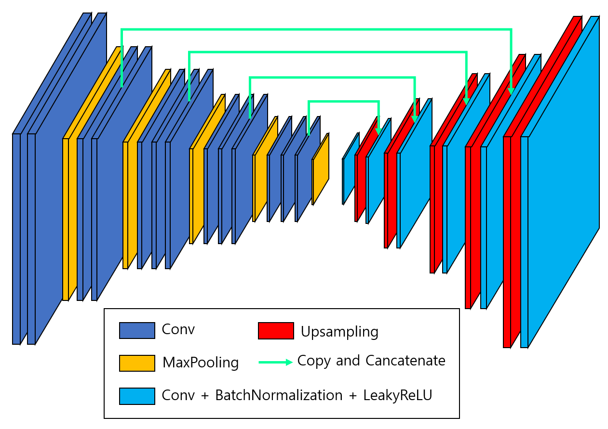

- Predictions

    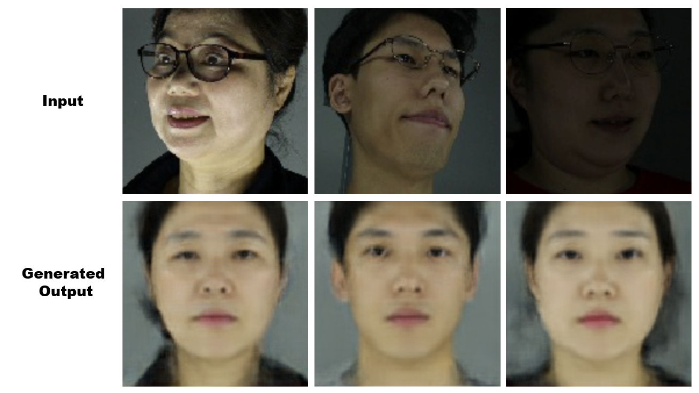

**dcgan.py**

 Deep Convolutional Generative Adversarial Networks(DCGAN) 모델을 참고하여 만들었습니다.

- Data

    X = 정면을 제외한 다양한 각도의 이미지

    Y = 각 각도에 1대1 매칭한 정면 이미지

- Structure

    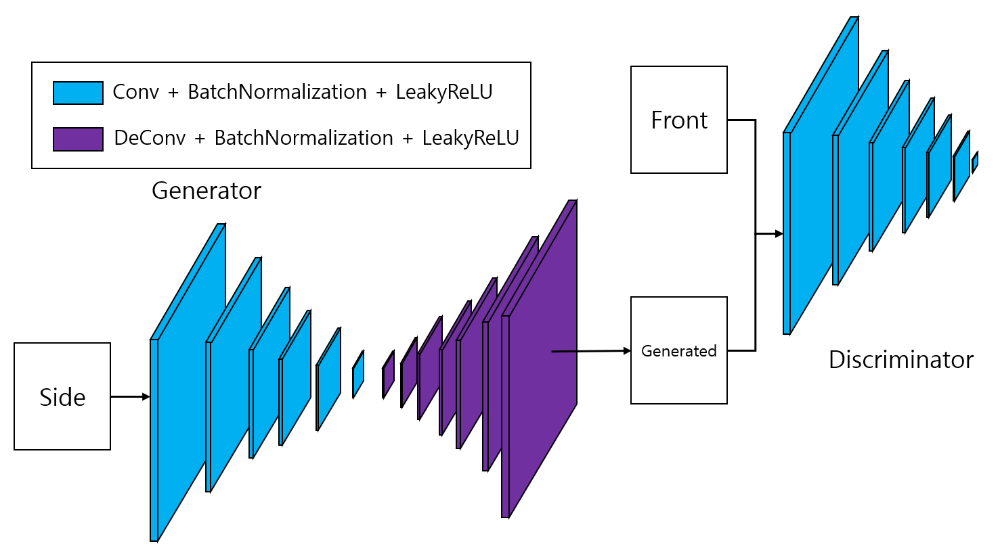

- Predictions

    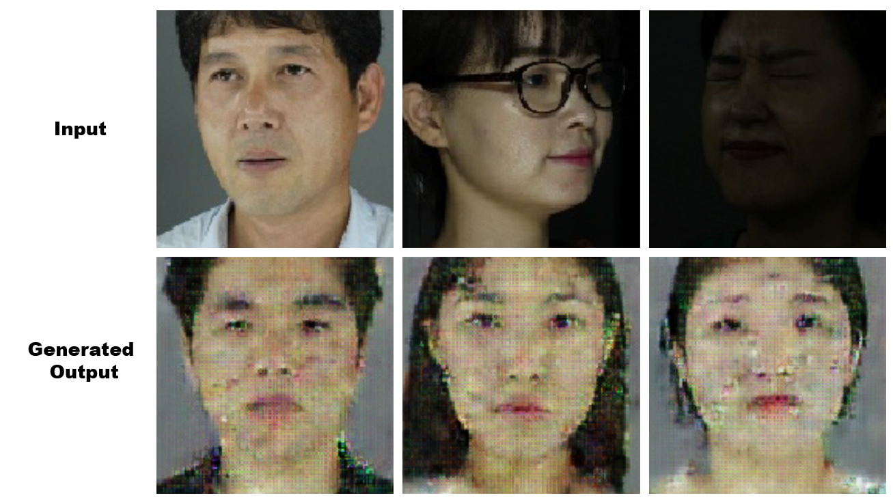

**cvae.py**

Conditional Variational Autoencoder(CVAE) 모델을 참고하여 만들었습니다.

- Data

    X = 정면 이미지를 포함한 13개 각도의 이미지(외국인 이미지)

    Y = 각 각도별 라벨

- Structure

    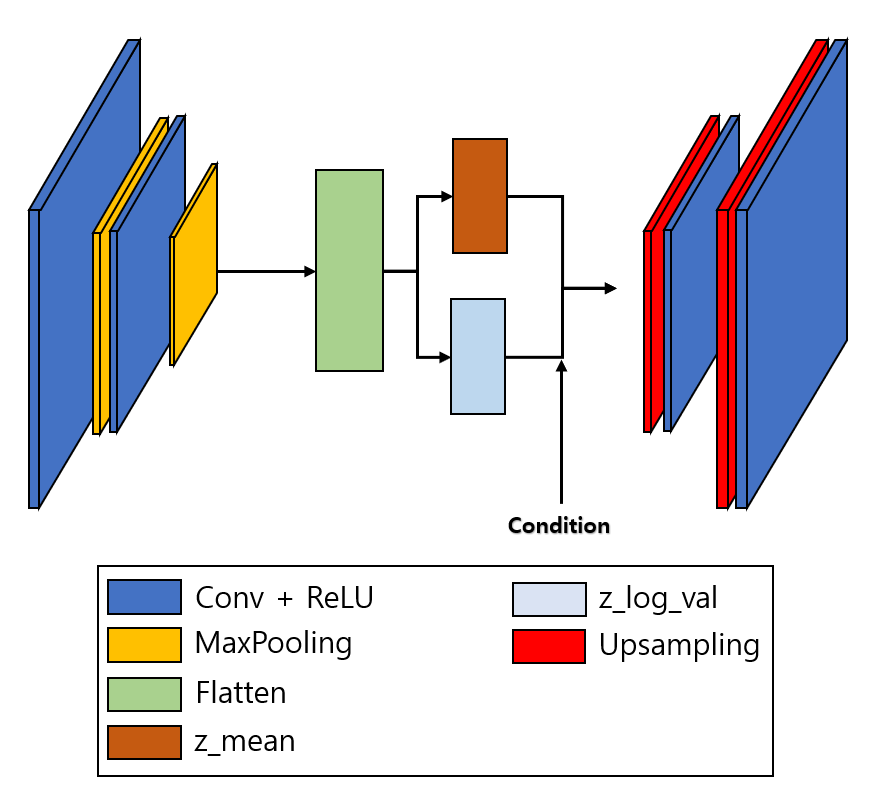

- Predictions

    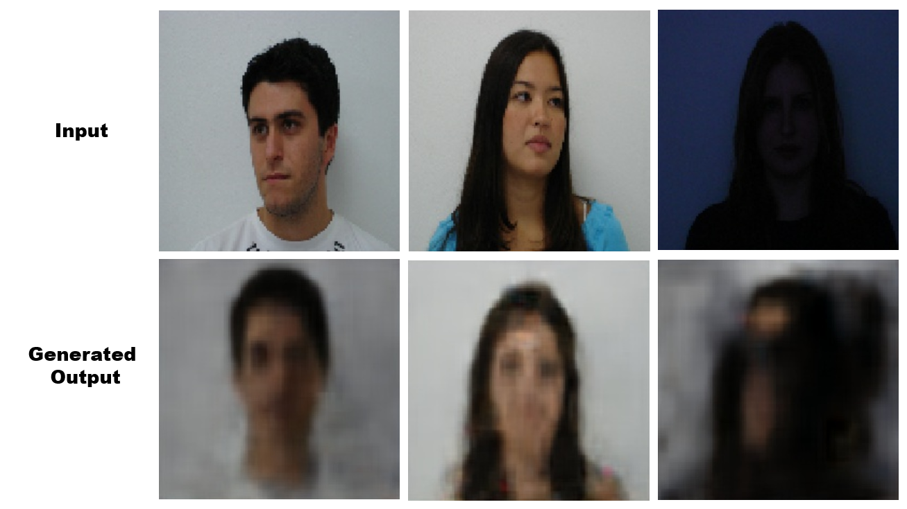

## WEB

---

**아래의 웹사이트에서 예측이 가능합니다.**(2019년 11월 29일 까지 운영)

[IMAGENIUS](http://imagenius.iptime.org:4/)
